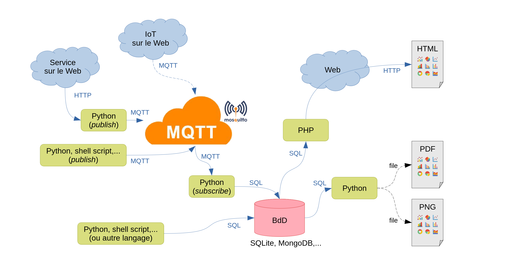

> Informations avec Thésée sur la SAÉ 23

| Module        | Enseignant       | Fichiers                                                                  |
| :---          |    :----         |          :---                                                             |
| SAÉ 23        | Manuel Munier    | [Cours de Mr. Munier](https://munier.perso.univ-pau.fr/temp/SAE23/)       |

## Notes de début

Je t'ai fait une [To Do List](https://github.com/users/xeylou/projects/2/views/1) ici pour réflechir à ce qu'on doit faire et qu'on soit tous les deux au courant, cf ton groupe r209... *Si tu n'aimes pas ou que tu travailles autrement dit-le moi :)*

Tu peux créer des tâches en appuyant sur les boutons 'Ajouter un élément' puis les faire glisser dans
une autre case si la tâche est en cours ou terminée. 🥇

Je serai sûrement en retard pour le premier TP, est-ce que tu pourrais s'il te plait lire vraiment, vraiment attentivement ce qu'il y a en dessous. On pourra discuter et agencer ce qu'on aura ensuite 🙂

---

# Le sujet

Pour le lire en entier c'est dans le tableau en haut.

Image représentative du sujet :

## Compréhension du sujet

Je te partage mon interprêtation du sujet avant d'arriver.

Mr. Munier nous demande dans un premier temps d'écrire un programme qui récupère des informations distribuées par un "broker" et de les stocker dans une base de données. Considère un broker comme une machine sur un réseau qui envoie en broadcast *(même si ça serait plus du multicast)* **de manière périodique des données à des abonnées**.

Imaginons qu'on utilise `Python3` pour ce programme, il récupèrerait ces données à l'aide d'une librairie *(ne t'en fais pas je t'explique dès que je suis là)* et les interprêterait pour les agencer dans une base de données `Sqlite3` par exemple ou en JSON pourquoi pas !

Il est précisé que le programme devra aussi *retransmettre les informations*. Si je me base sur le schéma du sujet, je pense qu'il veut parler de la création d'un fichier PDF, une image PNG/JPG ou une page HTML par exemple. *présent sur la partie droite du schéma*.

## Interprêtation du sujet

De mon point de vue, je distingue trois grandes parties pour cette SAÉ :

1. Récupèration et filtrage des données
2. Manipulation et agencement de ces données
3. Exportation sous différents supports

Il faudrait comprendre comment fonctionne le protocole MQTT, avoir les informations sur les données que le broker envoie périodiquement sans oublier ses informations de connexion (@ip, port, à quelle *topic* on doit s'abonner etc.). On pourra aussi faire des *publish* si on comprend comment le broker est configuré (je laisse ça pour l'instant). Le tout en codant en Python.

La manipulation se rapproche vraiment de l'exportation dans mon sens, cette partie servirait à agencer les données reçues pour mieux les interprêter lors de l'exportation. Je prends l'exemple d'une station météo : imaginons que l'on conserve en plus de la température et de l'humidité l'heure à laquelle les informations sont arrivées. Si on sauvegarde ces données dans une base de données, on pourrait lors de l'export choisir la plage d'heure à laquelle on voudrait ses informations. *(pas sûr que ce soit clair)*

L'exportation consistera à regrouper certaines informations obtenues et à les exporter dans différents formats. Un programme (Python, PHP...) s'occuperait d'un format (image, page web, pdf etc.). La manipulation ayant déjà trié les informations et stockées, reste plus qu'à les utiliser.

## Solutions apportées

Je ne m'avance pas trop dans l'ensemble *(on en a pas encore discuté...)*. Néanmoins je pense que je peux essayer apporter des points intéressants ou des idées.

Mr. Munier dit avoir fourni un programme Python pour récupérer des données d'un site qui distribue des informations météo. Je prends ça comme un exemple qui pourrait être probant pour la récupération des données envoyées par le broker MQTT.

J'ai fait des recherches sur l'utilisation du protocole MQTT en Python et je suis plutôt confiant pour l'instant (naïf). On a déjà étudié le format de fichier JSON en Python. Pour les PDF j'ai aussi recherché et trouvé une idée qui me semble intéressante. Pour les images (png, jpg...) j'avais pensé à exporté un graphique, comme avec matplotlib, une courbe de température en fonction du temps ou quelque chose comme ça.

Je mets ici les attendu de Mr. Munier.

* Ce qu'il faut absolument faire :
    * programme Python qui envoie des données via MQTT
    * programme Python qui reçoit des données via MQTT et les stocke dans une BdD
    * site web dynamique (aka scripts PHP) qui présente les données via une interface web avec la génération de graphiques
* Ce qui est fortement conseillé :
    * dans les messages MQTT, la "charge utile" (le *payload*) est une chaine de caractères → pour envoyer des données structurées on peut utiliser JSON par exemple
    * écrire des programmes qui vont chercher des données sur le web (ex : OpenData) et les envoient sur notre plateforme en MQTT

* Ce qui serait un plus :
    * écrire un programme qui génère un document PDF à partir des données
    * écrire un programme qui génère une image PNG à partir des données; cette image pourrait d'ailleurs ensuite être incluse dans une page web (NB : moins dynamique que si c'est un script PHP qui génère cette image à la volée

---

## Notes de fin

C'était chiant ? 😐

Sérieusement hésitez pas à relire le document un peu attentivement. Si j'ai fait des erreurs dans la compréhension dès le départ ça serait horrible je pense.

Merci beaucoup d'avoir lu, vraiment.
À tout à l'heure !
